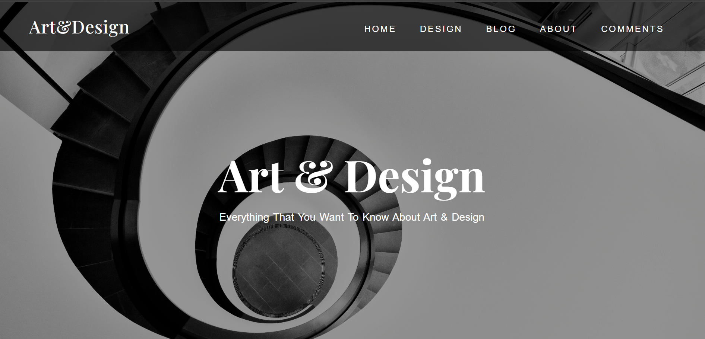
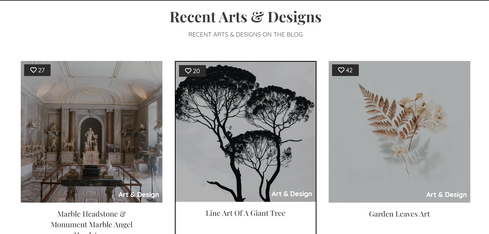
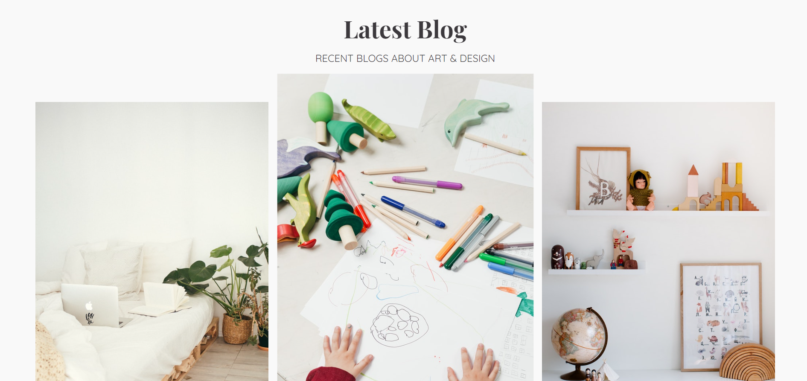
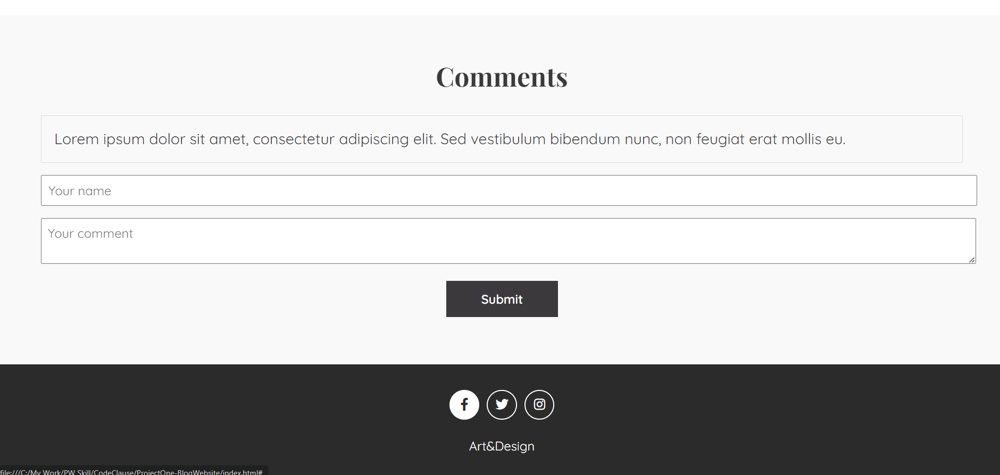
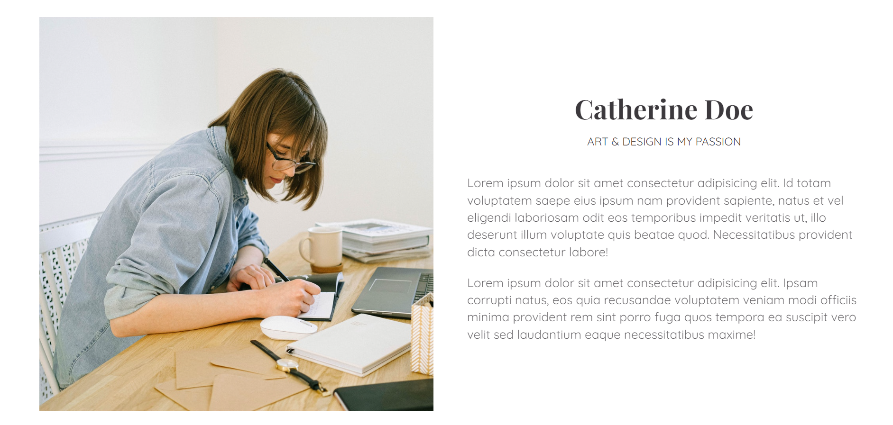

  <h1 align="center">Art & Design Blog Website</h1>

  

    Welcome to our Art and Design Blog! Explore captivating stories, creative insights, and inspiring content that celebrate the world of art and design.
     
     
    <a href="[https://github.com/](https://github.com/Namratapatel9027/CodeClauseInternship/tree/main/ProjectOne-BlogWebsite)"><strong>Explore the Project »</strong></a>
     
     
  

## Table Of Contents

* [About the Project](#about-the-project)
* [Built With](#built-with)
* [Getting Started](#getting-started)
* [Contributing](#contributing)
* [License](#license)

## About The Project

<h1 align="center">Screenshots</h1>

<!-- Add screenshots of your web application -->

Dive into the world of art and design with our captivating blog website! Our platform offers a diverse range of content, including insightful articles, stunning visuals, and thought-provoking discussions.

Here's why:

* Inspiring content: Discover captivating stories and creative insights that celebrate the beauty and innovation of art and design.
* Engaging visuals: Immerse yourself in a visually stunning experience that enhances your appreciation for artistic expression.
* Thought-provoking discussions: Join the conversation and explore new perspectives on the latest trends and developments in the art and design world.
  
## Built With

Frontend: HTML, CSS

## Getting Started

This is an example of how you can set up the project locally.

## Contributing
Contributions are welcome! If you find any bugs or have suggestions for new features, please open an issue or submit a pull request. For major changes, please open an issue first to discuss the proposed changes.

## License
This project is licensed under the MIT License - see the LICENSE file for details.

Thank you for choosing the Art and Design Blog! 🎨✨
