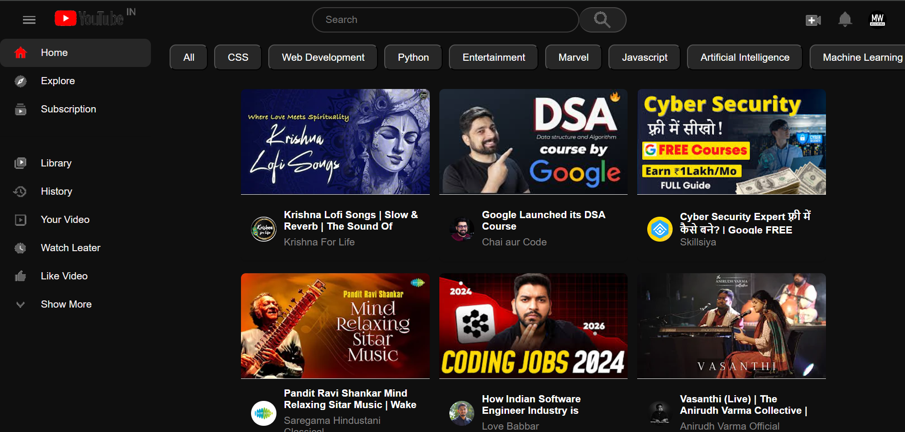
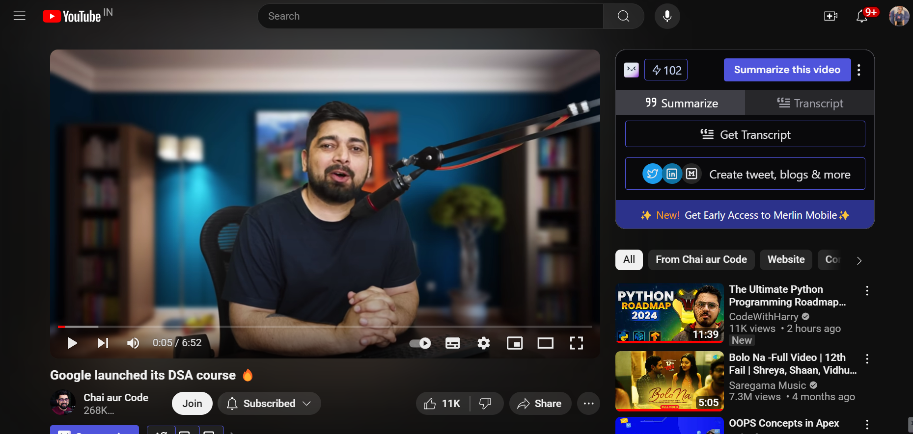

  <h1 align="center">Video Streaming Website</h1>

  

    Welcome to Yotube Clone - the ultimate video streaming platform inspired by YouTube. Explore a vast library of videos, create your own content, and join a vibrant community of creators and viewers.
    
     
    <a href="https://github.com/Namratapatel9027/CodeClauseInternship/new/main/ProjectThree-YoutubeClone"><strong>Explore the Project »</strong></a>
     
     
  

## Table Of Contents

* [About the Project](#about-the-project)
* [Built With](#built-with)
* [Contributing](#contributing)
* [License](#license)

## About The Project

<h1 align="center">Screenshots</h1>

<!-- Add screenshots of your web application -->

Here's why:

YouTubeClone is a comprehensive video streaming platform inspired by YouTube that empowers creators and delights viewers. With its user-friendly interface and robust features, YouTubeClone aims to provide a similar experience to YouTube for consuming and sharing video content online.
 
## Built With

Frontend: HTML, CSS, JavaScript

### Contributing
Contributions are welcome! If you find any bugs or have suggestions for new features, please open an issue or submit a pull request. For major changes, please open an issue first to discuss the proposed changes.

### License
This project is licensed under the MIT License - see the LICENSE file for details.

Thank you for choosing the Youtube Clone!😊

