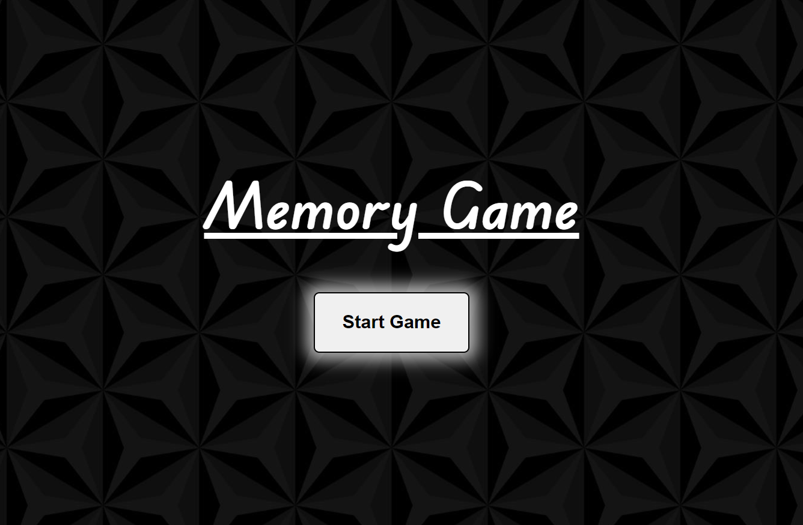
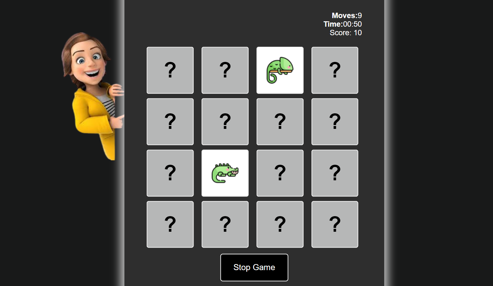
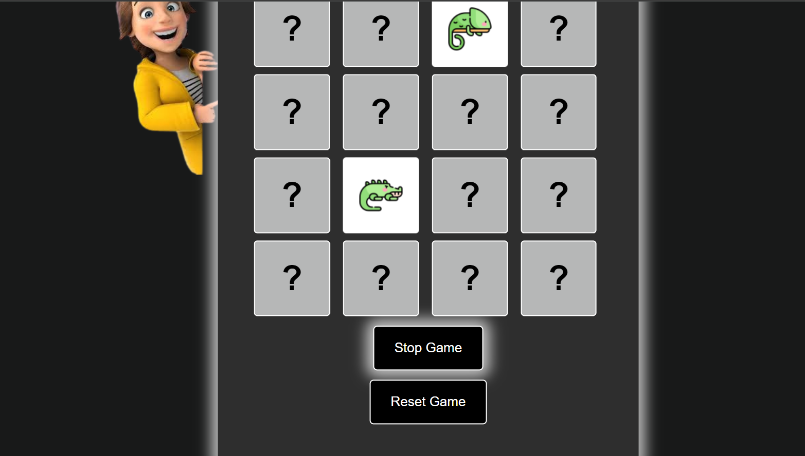

<p align="center">
  <h1 align="center">Memory Game</h1>

  <p align="center">
    Welcome to the Memory Game! Test your memory skills and have fun matching pairs of cards in this exciting and challenging game.
    <br/>
    <br/>
    <a href="[https://github.com/YourUsername/MemoryGame](https://github.com/Namratapatel9027/CodeClauseInternship/new/main/ProjectTwo-MemoryGame)"><strong>Explore the Project »</strong></a>
    <br/>
    <br/>
  </p>
</p>

## Table Of Contents

* [About the Project](#about-the-project)
* [Built With](#built-with)
* [Getting Started](#getting-started)
  * [Installation](#installation)
* [Contributing](#contributing)
* [License](#license)

## About The Project

<h1 align="center">Screenshots</h1>

<!-- Add screenshots of your web application -->




Embark on a thrilling adventure with the Memory Game! Test your memory prowess as you match pairs of cards in this immersive and addictive game experience.

Here's why:

* Challenging gameplay: Exercise your memory skills and concentration as you strive to match pairs of cards within the allotted time.
* Engaging visuals: Immerse yourself in a visually appealing interface that enhances the gaming experience and captivates players of all ages.
* Interactive features: Enjoy exciting features such as a timer, score tracking, and reset option, adding depth and excitement to the gameplay.
  
## Built With

Frontend: HTML, CSS, JavaScript

## Getting Started

This is an example of how you can set up the project locally.

### Installation

1. Clone the Repository: Clone this repository to your local machine using the following command:

```sh
git clone (https://github.com/Namratapatel9027/CodeClauseInternship/new/main/ProjectTwo-MemoryGame.git
